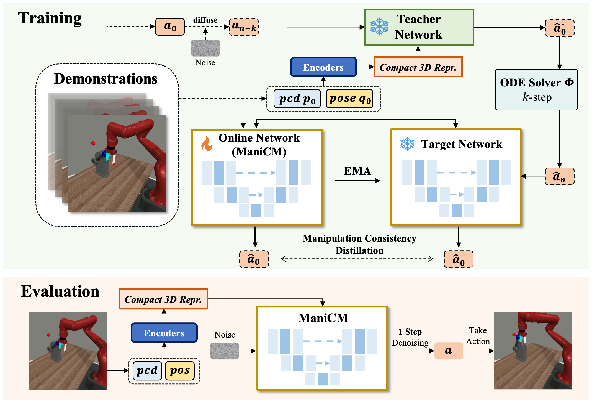

# [ManiCM: Real-time 3D Diffusion Policy via Consistency Model for Robotic Manipulation](https://manicm-fast.github.io/)

[Project Page (coming soon)](https://manicm-fast.github.io/) | [arXiv (coming soon)]() | [Paper (coming soon)]() 

[Guanxing Lu](https://guanxinglu.github.io/)\*, Zifeng Gao\*, [Tianxing Chen](https://tianxingchen.github.io), [Wenxun Dai](https://github.com/Dai-Wenxun), [Ziwei Wang](https://ziweiwangthu.github.io/), [Yansong Tang](https://andytang15.github.io/)

[](https://hits.seeyoufarm.com)


<b>ManiCM Overview</b>: Given a raw action sequence a<sub>0</sub>, we first perform a forward diffusion to introduce noise over n + k steps. The resulting noisy sequence a<sub>n+k</sub> is then fed into both the online network and the teacher network to predict the clean action sequence. The target network uses the teacher network’s k-step estimation results to predict the action sequence. To enforce self-consistency, a loss function is applied to ensure that the outputs of the online network and the target network are consistent.


# 💻 Installation

See [INSTALL.md](INSTALL.md) for installation instructions. 


# 🛠️ Usage
**Algorithms**. We provide the implementation of the following algorithms: 
- DP3: `dp3.yaml`
- ManiCM: `dp3_cm.yaml`


Scripts for generating demonstrations, training, and evaluation are all provided in the `scripts/` folder. 

The results are logged by `wandb`, so you need to `wandb login` first to see the results and videos.

For more detailed arguments, please refer to the scripts and the code. We here provide a simple instruction for using the codebase.

1. Generate demonstrations by `gen_demonstration_adroit.sh` and `gen_demonstration_dexart.sh`. See the scripts for details. For example:
    ```bash
    bash scripts/gen_demonstration_adroit.sh hammer
    ```
    This will generate demonstrations for the `hammer` task in Adroit environment. The data will be saved in `3D-Diffusion-Policy/data/` folder automatically.


2. Train and evaluate a policy with behavior cloning. For example:
    ```bash
    bash scripts/train_policy.sh dp3 adroit_hammer 0603 0 0
    ```
    This will train a DP3 policy on the `hammer` task in Adroit environment using point cloud modality. By default we **save** the ckpt (optional in the script).

3. Move teacher's ckpt. For example:
    ```bash
    bash scopy.sh dp3_cm adroit_hammer 0603 0603_cm 0 0
    ```

4. Train and evaluate ManiCM. For example:
    ```bash
    bash scripts/train_policy_cm.sh dp3_cm adroit_hammer 0603_cm 0 0
    ```
    This will train ManiCM use a DP3 policy teacher model on the `hammer` task in Adroit environment using point cloud modality.
